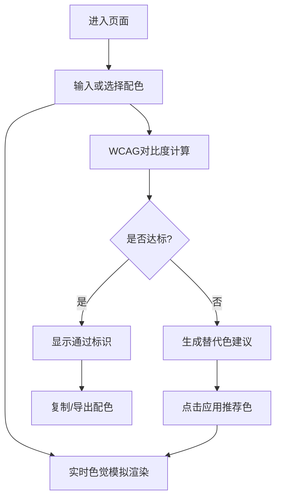

## 1. 产品概述

色觉友好配色检查器是一款面向设计师、前端开发和运营人员的在线工具，帮助用户快速验证配色方案对色弱人群的友好程度，无需安装复杂专业软件。

- 核心价值：降低色觉无障碍设计门槛，让普通设计者也能产出对色弱群体友好的作品
- 目标人群：UI设计师、前端工程师、运营设计人员、产品经理

## 2. 核心功能

### 2.1 功能模块

1. **配色输入区**：颜色值手动输入 + 预设调色板 + 颜色拾取器 + 主/辅/背景/文字四色系统
2. **色觉模拟区**：8种常见色觉类型实时预览 + 示例海报/卡片/图表场景
3. **对比评分区**：WCAG 2.1 AA/AAA 对比度检测 + 文字可读性评分 + 层级清晰度评估
4. **替代建议区**：智能色觉友好配色推荐 + 与原色相似度排序 + 一键应用

### 2.3 页面详情

| 页面名称 | 模块名称 | 功能描述 |
|-----------|-------------|---------------------|
| 主页面 | 配色输入区 | HEX/RGB双格式输入、输入即时校验、调色板快选、拾色器、四色角色定义（主色/辅色/背景/文字） |
| 主页面 | 色觉模拟区 | 8种色觉类型切换（正常/红色弱/绿色弱/蓝色弱/红色盲/绿色盲/蓝色盲/全色盲）、卡片/海报/图表三种场景预览 |
| 主页面 | 对比评分区 | 背景vs文字对比度数值、AA/AAA通过判定（普通/大号文字）、主辅色色差评分、综合无障碍分数 |
| 主页面 | 替代建议区 | 基于当前色生成5组接近色替代方案、每组含对比评分、点击一键应用到配色 |

## 3. 核心流程

用户进入页面 → 通过输入/调色板/拾色器设置四色配色 → 实时查看8种色觉下的模拟效果 → 查看对比度评分与WCAG合规结果 → 若评分不达标，浏览替代色建议 → 点击一键应用推荐配色 → 导出配色方案

## 4. 用户界面设计

### 4.1 设计风格
- **主色**：#10B981 翡翠绿（传达无障碍、信任感）
- **辅色**：#6366F1 靛蓝（技术感、精准度）
- **背景**：#FAFAF9 暖米白 + 细微噪点纹理
- **按钮风格**：圆角12px、微阴影、悬停上浮2px
- **字体**：展示用 "Fraunces" 衬线字体 + 正文用 "JetBrains Mono" 等宽字体
- **布局**：左侧控制面板 + 右侧大预览区的双栏布局，卡片化模块
- **图标风格**：Lucide 线性图标 + 轻微强调色填充

### 4.2 页面设计概述

| 页面名称 | 模块名称 | UI Elements |
|-----------|-------------|-------------|
| 主页面 | 顶部导航 | 品牌标识（Fraunces大字号）、副标题、主题切换 |
| 主页面 | 配色输入区 | 四大色块卡（可点击拾色）、HEX输入框（带#前缀）、预设色板（24色x4行网格）、角色标签（主/辅/背/文） |
| 主页面 | 色觉模拟区 | 8个视觉类型Tab切换按钮、预览画布（内含海报+卡片+图表三个子场景）、对比查看模式 |
| 主页面 | 评分卡 | 大号数字对比度、AA/AAA徽章（绿=通过/红=不通过）、环形进度条综合分、分项指标条 |
| 主页面 | 替代建议 | 5组横向色卡列、每组含新旧两色对比 + 评分标签、悬停放大动效、一键应用按钮 |

### 4.3 响应式
- 桌面优先（≥1280px）：左右双栏 380px + 弹性右侧
- 平板（768-1279px）：上下堆叠、配色输入区改为横向
- 移动端（<768px）：单列垂直滚动、模拟区缩放适配、调色板减少列数
