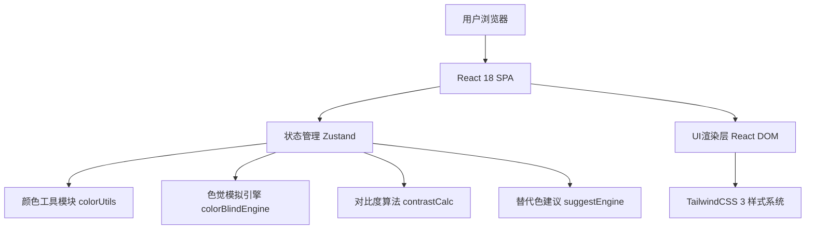

## 1. 架构设计



纯前端单页应用，所有算法在客户端执行，零后端依赖，可离线使用。

## 2. 技术描述

- **前端框架**：React@18 + TypeScript@5
- **构建工具**：Vite@6
- **样式方案**：TailwindCSS@3 + CSS变量
- **状态管理**：Zustand
- **图标库**：lucide-react
- **后端**：无（纯前端应用）
- **数据持久化**：localStorage 保存最近配色方案

## 3. 路由定义

| 路由 | 用途 |
|-------|---------|
| / | 主应用页面（所有功能集成于单页） |

## 4. 数据结构与状态模型

### 4.1 Zustand Store

```typescript
interface PaletteState {
  colors: {
    primary: string    // 主色 HEX
    secondary: string  // 辅色 HEX
    background: string // 背景色 HEX
    text: string       // 文字色 HEX
  }
  activeColorRole: 'primary' | 'secondary' | 'background' | 'text'
  currentVision: VisionType
  setColor: (role: ColorRole, hex: string) => void
  setActiveRole: (role: ColorRole) => void
  setVision: (v: VisionType) => void
  applySuggestion: (role: ColorRole, hex: string) => void
}

type VisionType = 
  | 'normal' 
  | 'protanopia' | 'protanomaly'   // 红
  | 'deuteranopia' | 'deuteranomaly' // 绿
  | 'tritanopia' | 'tritanomaly'   // 蓝
  | 'achromatopsia'               // 全色盲
```

### 4.2 核心工具模块

| 模块 | 导出函数 | 说明 |
|------|---------|------|
| colorUtils.ts | hexToRgb, rgbToHex, rgbToHsl, hslToRgb, clamp | 颜色空间互转 |
| colorBlindEngine.ts | simulateColor, applyVisionMatrix | LMS色觉矩阵转换，实现8种模拟 |
| contrastCalc.ts | relativeLuminance, contrastRatio, wcagPass | WCAG 2.1对比度计算 |
| suggestEngine.ts | generateSuggestions, adjustColorForContrast | 遗传式搜索近似合规色 |

## 5. 文件结构

```
src/
├── components/
│   ├── ColorInput.tsx        # 单个颜色输入卡（拾色+输入）
│   ├── PaletteGrid.tsx       # 预设调色板网格
│   ├── VisionTabs.tsx        # 8种色觉切换标签
│   ├── PreviewCanvas.tsx     # 模拟预览画布（海报/卡片/图表）
│   ├── ContrastScore.tsx     # 对比度评分卡
│   ├── SuggestionList.tsx    # 替代色建议列表
│   └── SectionCard.tsx       # 通用区块容器
├── hooks/
│   └── useLocalStorage.ts    # 本地持久化
├── store/
│   └── usePaletteStore.ts    # Zustand 状态
├── utils/
│   ├── colorUtils.ts
│   ├── colorBlindEngine.ts
│   ├── contrastCalc.ts
│   └── suggestEngine.ts
├── App.tsx
├── main.tsx
└── index.css
```
